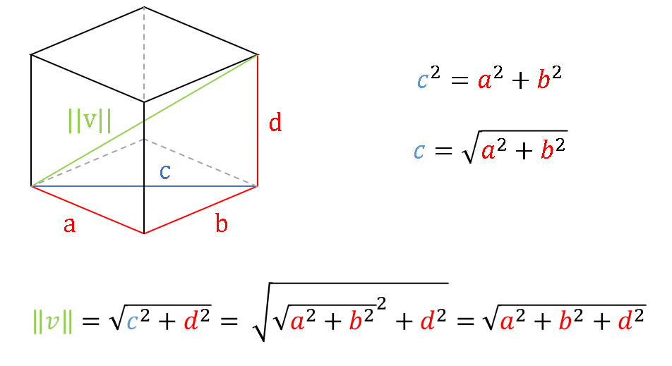
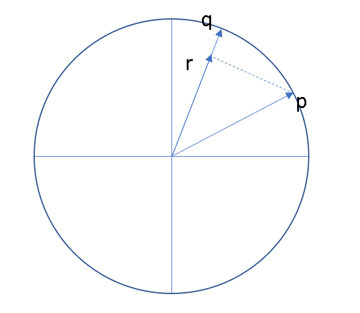

# Oblig V2019: Ordvektorer
Denne obligen fra 2019 går mer i dybden på hvordan man implementerer vektorromrepresentasjoner. Løsningsforslaget gir blant annet eksempler på hvordan man kan beregne euclidian distance, cosine similarity og implementere KNN. 

## Oppgave 1
Dataene som benyttes i obligen er et ferdig tokenisert aviskorpus som skal prosesseres videre i oppgave 1a.
For å representere ord som vektorer benytter vi et "kontekstvindu", det vil si at vi ser på et visst antall ord før og etter ordet. Dette implementeres i 1b. 


### 1c: Telling
Fordi vektorene vil inneholde et stort antall nuller, implementerer vi co-occurence-matrisen som en "sparse matrix" i form av en dictionary av dictionaries. Fit og transform fungerer her noe annerledes enn de gjør for dokumentfevktorer:
<br><br><b>Dokumentvektorer</b><br>
<i>Fit:</i> Oppretter vokabularet - velger hvilke ord som skal være i matrisene basert på hva som finnes i treningsdataene.<br>
<i>Transform:</i> Tar inn ett eller flere dokumenter, teller ordfrekvenser og returnerer dokumentene som vektorer. Den returnerer en document-term matrix som viser frekvensene ordene i vokabularet har i hvert dokument.

<b>Ordvektorer</b><br>
<i>Fit:</i> oppretter matrise (co-occurence-matrix) og fyller inn frekvenser for ord i treningsdataene<br>
<i>Transform:</i> Tar inn ett eller flere ord og returnerer dem som vektorer ved å hente de ut av matrisen. Her gir det altså ikke mening å bruke ord som modellen ikke har "sett".


## Oppgave 2

### 2a: Vektorlengde
```python
def vector_norm(self, word):
    vec = self.matrix[word]
    return math.sqrt(sum(v**2 for v in vec.values()))
```
For å finne lengen på en vektor finner vi kvadratroten av summen til kvadratet av alle dimensjonene.
Det vil si at vi bruker pythagoras læresetning. For å forstå hvordan den kan brukes i flere enn to dimensjoner kan man tenke seg hvordan det foregår i en tredimensjonal boks. Man regner da først ut lengden på diagonalen i grunnflaten. Ved å anvende pythagoras læresetning rekursivt kan vi da finne lengden på den tredimensjonale vektoren. Vi regner med andre ord ut lengden av hypotenusen til en ny trekant som står diagonalt inne i boksen:



Se også:
[https://www.uio.no/studier/emner/matnat/ifi/IN2110/v19/foiler/05_ordvektorer.pdf](https://www.uio.no/studier/emner/matnat/ifi/IN2110/v19/foiler/05_ordvektorer.pdf)


### 2b Avstand  (Euclidean distance)
```python
def euclidean_distance(self, w1, w2):
    vec1, vec2 = self.transform((w1, w2))
    
    # Save computation by only computing values for features that
    # are active in one of the vectors.
    union = vec1.keys() | vec2.keys()
  
    return math.sqrt(sum((vec1[key] - vec2[key])**2
                         for key in union))
```
Her regner vi på en måte ut lengden på en vektor mellom "endene" av de to ordvektorene.<br>
Se også: [https://www.uio.no/studier/emner/matnat/ifi/IN2110/v19/foiler/05_ordvektorer.pdf](https://www.uio.no/studier/emner/matnat/ifi/IN2110/v19/foiler/05_ordvektorer.pdf)


### 2c Likhet (cosine similarity)
```python
def cosine_similarity(self, w1, w2):
    
    vec1, vec2 = self.transform((w1, w2))
    
    # Save computatoin by only computing values for features that
    # are active in both vectors
    intersect = set(vec1.keys()).intersection(vec2.keys())

    dot_product = sum(vec1[key]*vec2[key] for key in intersect)

    # Return dot product for normalized vectors
    if self.is_normalized:
        return dot_product
    else:
        return dot_product / (self.vector_norm(w1)*self.vector_norm(w2))
```
For å finne cosine similarity deler vi prikkproduktet med produktet av lengden på vektorene. Prikkproduktet kan forstås som lengden på en ny vektor langs den ene av vektorene som danner en rettvinklet trekant med den andre vektoren.<br>
Se også: [https://www.uio.no/studier/emner/matnat/ifi/IN2110/v19/foiler/05_ordvektorer.pdf](https://www.uio.no/studier/emner/matnat/ifi/IN2110/v19/foiler/05_ordvektorer.pdf)

### 2d Normalisering
```python
def normalize_vectors(self):
    for w, vec in self.matrix.items():
        norm = self.vector_norm(w)

        for key in vec:
            vec[key] /= norm

    self.is_normalized = True
```
Vi normaliserer ved å dele ordrekvensene på vektorlengden. Verdiene vil da ligge mellom 0 og 1.
Med normaliserte vektorer blir cosine similarity det samme som prikkproduktet. For å visualisere det:<br>

<br>Her kan man se at lengden på r nærmer seg lengden av q hvis vinkelen mellom p og q blir mindre. Siden vi har å gjøre med normaliserte vektorer (enhetsvektorer), vil denne lengden maksimaøt være 1. Hvis vinkelen mellom p og q er 90 grader, vil lengden på r bli 0.

### 3 Naboskap (knn)
```python
def nearest_neighbors(self, w, k = 5):
    if w in self.vocab:
        others = []
        
        for other in self.matrix:
            if other != w:
                others.append((other, self.cosine_similarity(w, other)))  
                
        return sorted(others, key = lambda x : -x[1])[:k]
```
Her returnerer vi de k ordene med størst cosine similarity til ordet w. Vi  passer også på å ikke regne med likheten ordet har med seg selv.
